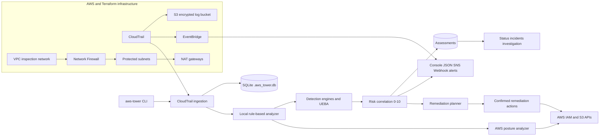

# IAM TOWER

<div align="center">

  ```
  ██╗███╗   ███╗ █████╗ ██╗    ██╗███████╗███████╗ ██████╗ ███╗   ███╗███████╗██╗
  ██║████╗ ████║██╔══██╗██║    ██║██╔════╝██╔════╝██╔═══██╗████╗ ████║██╔════╝██║
  ██║██╔████╔██║███████║██║ █╗ ██║█████╗  ███████╗██║   ██║██╔████╔██║█████╗  ██║
  ██║██║╚██╔╝██║██╔══██║██║███╗██║██╔══╝  ╚════██║██║   ██║██║╚██╔╝██║██╔══╝  ╚═╝
  ██║██║ ╚═╝ ██║██║  ██║╚███╔███╔╝███████╗███████║╚██████╔╝██║ ╚═╝ ██║███████╗██╗
  ╚═╝╚═╝     ╚═╝╚═╝  ╚═╝ ╚══╝╚══╝ ╚══════╝╚══════╝ ╚═════╝ ╚═╝     ╚═╝╚══════╝╚═╝
  ```

  **AWS Identity Monitoring · Local · Rule-Based**

  [](https://www.python.org/downloads/)
  [](https://opensource.org/licenses/MIT)
  [](https://github.com/astral-sh/ruff)

</div>

---

## 📋 Table of Contents

- [Overview](#overview)
- [Key Features](#key-features)
- [Architecture](#architecture)
- [Installation](#installation)
- [Quick Start](#quick-start)
- [Usage Guide](#usage-guide)
- [Detection Capabilities](#detection-capabilities)
- [Security Posture Analysis](#security-posture-analysis)
- [Remediation System](#remediation-system)
- [Configuration](#configuration)
- [Technical Details](#technical-details)
- [Development](#development)
- [Contributing](#contributing)
- [License](#license)

---

## 🎯 Overview

**IAM TOWER** is a production-grade, local security monitoring tool for AWS environments. It provides real-time threat detection, security posture analysis, and automated remediation planning for AWS IAM and S3 resources—all without requiring external AI services or cloud dependencies.

### Why IAM TOWER?

- **🔒 Zero External Dependencies**: Runs entirely locally with deterministic, auditable rules
- **⚡ Real-Time Detection**: Identifies security threats as they occur in CloudTrail logs
- **🎯 Comprehensive Coverage**: 9 detection engines covering IAM, network, behavioral, and identity analytics
- **🛡️ Posture Management**: Continuous evaluation of AWS security configurations
- **🔧 Automated Remediation**: Template-based remediation plans with safe defaults
- **📊 Production Ready**: Automated tests, persistent event history, comprehensive error handling, and Terraform infrastructure

---

## ✨ Key Features

### Threat Detection Engine
- **Sensitive IAM Activity Detection**: Monitors restricted operations like `AttachUserPolicy`, `CreateAccessKey`
- **Root Account Monitoring**: Flags any root account usage with CRITICAL severity
- **Network Anomaly Detection**: Identifies activity from untrusted IP addresses
- **Behavioral Analytics**: Detects out-of-hours activity and access-denied spikes
- **UEBA (User Entity Behavior Analytics)**: First-time sensitive actions and impossible travel detection

### Security Posture Analysis
- **IAM Policy Analysis**: Identifies overly permissive policies and privilege escalation paths
- **S3 Bucket Security**: Detects public access, missing encryption, and versioning issues
- **Access Key Hygiene**: Monitors key age, usage patterns, and rotation requirements
- **User Security**: Tracks MFA enrollment and password policy compliance

### Remediation System
- **Template-Based Plans**: Pre-built remediation templates for common incidents
- **Safe Defaults**: All actions require explicit confirmation by default
- **Rollback Support**: Maintains audit trail for remediation actions
- **Multi-Action Workflows**: Chains multiple remediation steps for complex incidents

### Operational Features
- **Real-Time Monitoring**: Continuous CloudTrail log ingestion and analysis
- **Multiple Output Formats**: Console, JSON, SNS, and webhook alert sinks
- **Persistent Configuration**: Configurable trusted networks, business hours, and thresholds
- **Cross-Platform**: Works on Windows, macOS, and Linux

---

## 🏗️ Architecture



```
┌─────────────────────────────────────────────────────────────────────┐
│                          CloudTrail Events                          │
└──────────────────────────────┬──────────────────────────────────────┘
                               │
                               ▼
                    ┌─────────────────────┐
                    │  Local Ingestion    │──► Normalizes to SecurityEvent
                    └──────────┬──────────┘
                               │
                               ▼
                    ┌─────────────────────┐
                    │  Detection Engine   │──► Restricted, IP, Time Detectors
                    └──────────┬──────────┘
                               │
                               ▼
                    ┌─────────────────────┐
                    │ Behavioral Engine   │──► Mass Download, UEBA Baselines
                    └──────────┬──────────┘
                               │
                               ▼
                    ┌─────────────────────┐
                    │  Risk Correlator    │──► Aggregates Findings, Applies Rules
                    └──────────┬──────────┘
                               │
                               ▼
                    ┌─────────────────────┐
                    │ Assessment Stored   │──► Saved to Assessment Repository
                    └──────────┬──────────┘
                               │
                               ▼
                    ┌─────────────────────┐
                    │ Posture Analyzer    │──► IAM, S3, Keys, User Hygiene
                    └──────────┬──────────┘
                               │
                               ▼
                    ┌─────────────────────┐
                    │ Remediation Planner │──► Template-Based Action Plans
                    └──────────┬──────────┘
                               │
                               ▼
                    ┌─────────────────────┐
                    │   Alert Manager     │──► Console / JSON / SNS / Webhook
                    └─────────────────────┘
```

### Core Components

| Component | Purpose | Location |
|-----------|---------|----------|
| **Ingestion** | CloudTrail log parsing and normalization | `aws_tower/tower/ingestion.py` |
| **Detection Engine** | Multi-detector threat analysis | `aws_tower/detection/engine.py` |
| **Behavioral Engine** | UEBA and pattern detection | `aws_tower/detection/behavioral_engine.py` |
| **Risk Correlator** | Finding aggregation and scoring | `aws_tower/detection/correlation.py` |
| **Posture Analyzer** | Security configuration evaluation | `aws_tower/posture/local_posture.py` |
| **Remediation Planner** | Action plan generation | `aws_tower/remediation/planner.py` |

---

## 📦 Installation

### Prerequisites

- Python 3.10 or higher
- AWS credentials configured (via `~/.aws/credentials`, environment variables, or IAM role)
- Appropriate IAM permissions for reading CloudTrail logs and analyzing IAM/S3 configurations

### Install from Source

```bash
# Clone the repository
git clone https://github.com/yourusername/iam-tower.git
cd iam-tower

# Create virtual environment
python -m venv .venv
source .venv/bin/activate  # On Windows: .venv\Scripts\activate

# Install in development mode
pip install -e .

# Verify installation
aws-tower --help
```

### AWS Permissions Required

```json
{
  "Version": "2012-10-17",
  "Statement": [
    {
      "Effect": "Allow",
      "Action": [
        "cloudtrail:DescribeTrails",
        "cloudtrail:LookupEvents",
        "cloudtrail:GetTrailStatus",
        "s3:GetObject",
        "s3:ListBucket",
        "iam:GetUser",
        "iam:ListUsers",
        "iam:ListAccessKeys",
        "iam:GetAccessKeyLastUsed",
        "iam:ListPolicies",
        "iam:GetPolicyVersion",
        "iam:GetLoginProfile",
        "iam:ListMFADevices",
        "iam:GetAccountSummary",
        "iam:GetAccountPasswordPolicy",
        "s3:GetBucketPolicy",
        "s3:GetBucketEncryption",
        "s3:GetBucketVersioning",
        "s3:GetPublicAccessBlock",
        "s3:ListBuckets"
      ],
      "Resource": "*"
    }
  ]
}
```

---

## 🚀 Quick Start

### 1. Analyze Sample Data

```bash
# Analyze the included sample CloudTrail logs
aws-tower analyze --file tests/fixtures/sample_cloudtrail.json --no-live
```

### 2. Check Security Posture

```bash
# Evaluate your AWS account's security configuration
aws-tower posture
```

### 3. Configure Trusted Networks

```bash
# Add your trusted IP ranges
aws-tower config set --add-trusted-network 192.168.0.0/16
aws-tower config set --add-trusted-network 10.0.0.0/8

# Set business hours (UTC)
aws-tower config set --business-start-hour 8 --business-end-hour 18
```

### 4. Start Continuous Monitoring

```bash
# Monitor with 60-second intervals
aws-tower monitor --interval 60
```

---

## 📖 Usage Guide

### Command Reference

#### `aws-tower ingest`

Fetch CloudTrail logs from S3 and/or CloudTrail API and ingest into the local analyzer.

```bash
# Auto-discover CloudTrail buckets and ingest
aws-tower ingest

# Ingest from specific file
aws-tower ingest --file path/to/cloudtrail.json

# Limit number of events
aws-tower ingest --max-results 50
```

**Options:**
- `--file, -f`: Local CloudTrail JSON file to analyze
- `--max-results, -m`: Maximum number of events to fetch (default: 50, max: 50)
- `--no-auto-discover`: Disable automatic S3 bucket discovery
- `--no-live`: Skip live CloudTrail API ingestion

---

#### `aws-tower analyze`

Fetch AWS logs and run the local rule-based threat analysis.

```bash
# Analyze all ingested events
aws-tower analyze

# Analyze specific file without live API calls
aws-tower analyze --file cloudtrail.json --no-live

# Override configuration for this run
aws-tower analyze --business-start-hour 9 --business-end-hour 17
```

**Options:**
- `--file, -f`: Local CloudTrail JSON file to analyze
- `--no-live`: Skip live CloudTrail API ingestion
- `--trusted-network, -n`: CIDR or IP considered trusted (can be repeated)
- `--business-start-hour`: Override business hours start (0-23 UTC)
- `--business-end-hour`: Override business hours end (0-23 UTC)

**Output:** Displays risk assessment with actor breakdown, findings table, and overall risk score.

---

#### `aws-tower posture`

Evaluate AWS IAM policies, S3 bucket policies, and access keys with local rules.

```bash
# Run full posture analysis
aws-tower posture
```

**Categories Analyzed:**
1. **IAM Policies**: Wildcard permissions, privilege escalation paths
2. **S3 Buckets**: Public access, encryption, versioning
3. **Access Keys**: Age, usage, rotation status
4. **IAM Users**: MFA enrollment, password age

**Output:** Displays findings by category with severity levels and recommendations.

---

#### `aws-tower remediate`

Generate and optionally execute a remediation plan for an actor.

```bash
# Generate remediation plan (review mode)
aws-tower remediate --actor alice --type compromised_credential

# Execute remediation automatically (USE WITH CAUTION)
aws-tower remediate --actor alice --type compromised_credential --execute
```

**Incident Types:**
- `compromised_credential`: Deactivate access keys, recommend IP block
- `privilege_escalation`: Detach policy, deactivate key
- `s3_public_access`: Block public access, update bucket policy
- `excessive_permissions`: Detach overly permissive policy
- `unauthorized_activity`: Deactivate keys, recommend IP block

**Options:**
- `--actor, -a`: Actor username, ARN, or principal ID (required)
- `--type, -t`: Incident type (default: unauthorized_activity)
- `--execute, -e`: Execute actions automatically (default: False)

**Safety Features:**
- All plans require confirmation by default
- Actions logged with timestamps
- Prior state preserved for rollback

---

#### `aws-tower monitor`

Run continuous local security monitoring daemon.

```bash
# Monitor with default 60-second interval
aws-tower monitor

# Custom interval and max cycles
aws-tower monitor --interval 120 --max-cycles 100

# Stop after N cycles
aws-tower monitor --max-cycles 10
```

**Options:**
- `--interval, -i`: Polling interval in seconds (default: 60)
- `--max-cycles`: Maximum monitoring cycles before stopping (default: unlimited)

**Behavior:**
- Polls CloudTrail API and S3 buckets on each cycle
- Analyzes new events and generates alerts
- Updates posture analysis periodically
- Runs until interrupted or max cycles reached

---

#### `aws-tower status`

Display Security Tower operational status and risk metrics.

```bash
aws-tower status
```

**Output:**
- Total ingested events
- Total assessed actors
- High-risk incident count
- Current configuration summary

---

#### `aws-tower incidents`

List recent security incidents and risk assessments.

```bash
# List incidents with default filters
aws-tower incidents

# Filter by minimum risk score
aws-tower incidents --min-risk 6.0

# Limit number of results
aws-tower incidents --min-risk 4.0 --limit 20
```

**Options:**
- `--min-risk, -r`: Minimum risk score filter (default: 4.0)
- `--limit, -n`: Maximum incidents to display (default: 10)

---

#### `aws-tower investigate`

Investigate security telemetry and timeline for an actor or IP address.

```bash
# Investigate by actor
aws-tower investigate --actor alice

# Investigate by IP address
aws-tower investigate --ip 203.0.113.42
```

**Options:**
- `--actor, -a`: Actor username, ARN, or principal ID
- `--ip`: Source IP address to investigate

**Output:**
- Timeline of actor's activities
- Risk assessment breakdown
- Associated findings and alerts
- Resource access patterns

---

#### `aws-tower config`

View or update persistent CLI configuration.

```bash
# View current configuration
aws-tower config show

# Set trusted networks (replaces existing)
aws-tower config set --trusted-network 192.168.1.0/24

# Add trusted networks (appends to existing)
aws-tower config set --add-trusted-network 10.0.0.0/8

# Clear all trusted networks
aws-tower config set --clear-trusted-networks

# Set business hours
aws-tower config set --business-start-hour 9 --business-end-hour 17

# Set detection thresholds
aws-tower config set --access-denied-window 15 --access-denied-threshold 10

# Reset to defaults
aws-tower config reset
```

**Configuration Options:**
- `--trusted-network, -n`: CIDR/IP considered trusted (replaces existing)
- `--add-trusted-network`: Append to trusted networks list
- `--clear-trusted-networks`: Remove all trusted networks
- `--business-start-hour`: Business hours start (0-23 UTC)
- `--business-end-hour`: Business hours end (0-23 UTC)
- `--access-denied-window`: Window for access-denied spike detection (minutes)
- `--access-denied-threshold`: Threshold for access-denied spike detection
- `--min-risk-score`: Minimum risk score for alerting (0.0-10.0)

**Configuration Storage:**
- Config stored in `~/.aws_tower.json`
- Can be version-controlled for team use
- Environment variable `AWS_TOWER_NO_BANNER=1` suppresses banner

---

## 🛡️ Detection Capabilities

### Detection Engines

| Engine | Type | Purpose |
|--------|------|---------|
| **RestrictedActivityDetector** | Rule-based | Identifies sensitive IAM operations |
| **OutOfCompanyIPDetector** | Network | Flags activity from untrusted IPs |
| **IrregularHourDetector** | Behavioral | Detects out-of-business-hours activity |
| **AccessDeniedSpikeDetector** | Behavioral | Identifies access-denied bursts |
| **RootAccountUsageDetector** | Rule-based | Flags any root account activity |
| **ConsoleLoginWithoutMFADetector** | Rule-based | Monitors console login events |
| **MassDownloadDetector** | Behavioral | Detects bulk data exfiltration attempts |
| **IdentityAnalyticsEngine** | UEBA | First-time actions and impossible travel |
| **RiskCorrelator** | Correlation | Aggregates and scores all findings |

### Detection Rules

| Rule ID | Category | Severity | Description |
|---------|----------|----------|-------------|
| `restricted_activity` | IAM Security | HIGH | Sensitive IAM operations (AttachUserPolicy, etc.) |
| `out_of_company_ip` | Network Anomaly | HIGH | Activity outside trusted networks |
| `irregular_hour` | Behavioral | MEDIUM | Activity outside business hours |
| `access_denied_spike` | Behavioral | MEDIUM | Burst of access-denied errors |
| `root_account_usage` | IAM Security | CRITICAL | Any root account activity |
| `console_login_no_mfa` | IAM Security | MEDIUM | Console login events |
| `ueba_privilege_escalation` | Identity Analytics | HIGH | First-time sensitive action |
| `ueba_impossible_travel` | Identity Analytics | HIGH | Rapid multi-region access |

### Risk Scoring

IAM TOWER uses a weighted severity system to calculate risk scores (0.0-10.0):

```
Risk Score = (Σ(Severity Weights) / Max Weight) × 10

Severity Weights:
- CRITICAL: 10
- HIGH: 6
- MEDIUM: 3
- LOW: 1
```

**Correlation Rules** amplify risk when multiple signals coexist:
- Restricted + Untrusted IP + Off-Hours: ×1.5 multiplier
- Restricted + Untrusted IP: ×1.25 multiplier

---

## 🔒 Security Posture Analysis

### IAM Policy Checks

| Rule | Severity | Issue Detected |
|------|----------|----------------|
| `iam_policy_admin_wildcard` | CRITICAL | Policy allows Action='*' on Resource='*' |
| `iam_policy_iam_wildcard` | CRITICAL | Policy allows iam:* on Resource='*' |
| `iam_policy_passrole_no_condition` | HIGH | iam:PassRole on '*' without Condition |
| `iam_policy_missing_condition` | MEDIUM | Broad permissions without Condition block |

### S3 Bucket Checks

| Rule | Severity | Issue Detected |
|------|----------|----------------|
| `s3_policy_public_allow` | HIGH | Bucket policy allows public access |
| `s3_public_access_block_missing` | MEDIUM | No PublicAccessBlock configuration |
| `s3_public_access_block_incomplete` | MEDIUM | Incomplete PublicAccessBlock settings |
| `s3_encryption_missing` | MEDIUM | No default encryption configured |
| `s3_versioning_disabled` | LOW | Bucket versioning not enabled |

### Access Key Checks

| Rule | Severity | Issue Detected |
|------|----------|----------------|
| `iam_access_key_age` | CRITICAL/HIGH | Key older than 90/180 days |
| `iam_user_multiple_active_keys` | MEDIUM | Multiple active keys per user |
| `iam_access_key_never_used` | LOW | Active key never used |

### User Hygiene Checks

| Rule | Severity | Issue Detected |
|------|----------|----------------|
| `iam_account_mfa_disabled` | HIGH | Root account has no MFA |
| `iam_user_no_mfa` | MEDIUM | User has no MFA device |
| `iam_user_password_age` | MEDIUM | Password older than 90 days |
| `iam_password_policy_missing` | MEDIUM | No custom password policy |
| `iam_password_policy_weak_length` | MEDIUM | Password length < 14 characters |
| `iam_password_policy_no_symbols` | LOW | Password policy doesn't require symbols |

---

## 🔧 Remediation System

### Incident Types and Actions

#### `compromised_credential`

**Summary**: Deactivate affected user's access keys and recommend blocking source IP.

**Steps**:
1. Deactivate all access keys for the user (auto-executable, requires confirmation)
2. Recommend WAF/SG/NACL deny rules for source IP (manual review)

**Required Fields**: `actor`, `key_id`  
**Optional Fields**: `ip`

---

#### `privilege_escalation`

**Summary**: Detach the policy that was just attached and deactivate the key.

**Steps**:
1. Detach sensitive policy from user (auto-executable, requires confirmation)
2. Deactivate access key used during escalation (auto-executable, requires confirmation)

**Required Fields**: `actor`, `policy_arn`  
**Optional Fields**: `key_id`

---

#### `s3_public_access`

**Summary**: Lock down bucket with Deny statement and enable public-access block.

**Steps**:
1. Append Deny statement to bucket policy (auto-executable, requires confirmation)
2. Enable all four PublicAccessBlock flags (auto-executable, requires confirmation)

**Required Fields**: `bucket`

---

#### `excessive_permissions`

**Summary**: Detach overly permissive managed policy and request review.

**Steps**:
1. Detach managed policy from user (auto-executable, requires confirmation)

**Required Fields**: `actor`, `policy_arn`

---

#### `unauthorized_activity`

**Summary**: Deactivate keys, suggest IP block, log advisory.

**Steps**:
1. Deactivate access keys (manual review, requires confirmation)
2. Recommend IP block across WAF/SG/NACL (manual review)

**Required Fields**: `actor`  
**Optional Fields**: `key_id`, `ip`

---

### Safety Features

1. **Confirmation Required**: All actions require explicit `--execute` flag
2. **Prior State Preserved**: Bucket policy changes maintain prior policy in results
3. **Audit Trail**: All remediation actions logged with timestamps
4. **Error Handling**: Failed actions don't block other steps
5. **Template Validation**: Missing required fields return error before execution

---

## ⚙️ Configuration

### Configuration File

The CLI stores configuration and history in the current working directory:

- `.aws_tower.json` — trusted networks, business hours, and thresholds
- `.aws_tower.db` — persisted CloudTrail events and assessments used by `status`,
  `incidents`, and `investigate`

```json
{
  "trusted_networks": [
    "192.168.0.0/16",
    "10.0.0.0/8"
  ],
  "business_start_hour": 8,
  "business_end_hour": 18,
  "access_denied_window_minutes": 10,
  "access_denied_threshold": 5,
  "min_risk_score": 4.0
}
```

### Environment Variables

| Variable | Purpose |
|----------|---------|
| `AWS_TOWER_NO_COLOR` | Set to `1` to disable colored output |
| `AWS_TOWER_NO_BANNER` | Set to `1` to suppress ASCII banner |

### Network Firewall

The Terraform configuration under `terraform/` creates a VPC inspection network,
per-AZ Network Firewall endpoints, protected subnets, and NAT gateways. Copy
`terraform/terraform.tfvars.example` to `terraform/terraform.tfvars` and replace
the example source CIDR with the public IP range AWS will see. Private LAN
addresses such as `192.168.35.31` are not visible to AWS API endpoints.

Network Firewall filters traffic routed through its VPC endpoints. Restricting
IAM API calls made directly over the internet requires an IAM policy or
Organizations SCP using `aws:SourceIp` as a separate control.

### Thresholds

| Setting | Default | Description |
|---------|---------|-------------|
| `KEY_AGE_HIGH_DAYS` | 90 | Days before key age triggers HIGH severity |
| `KEY_AGE_CRITICAL_DAYS` | 180 | Days before key age triggers CRITICAL severity |
| `PASSWORD_AGE_MEDIUM_DAYS` | 90 | Days before password age triggers MEDIUM severity |
| `MIN_RECOMMENDED_PASSWORD_LENGTH` | 14 | Minimum recommended password length |

---

## 🔬 Technical Details

### AWS Deployment

Terraform creates the AWS resources under `terraform/`. Configure the approved
public source range in `terraform/terraform.tfvars` before applying:

```hcl
allowed_source_cidrs = ["203.0.113.10/32"]
```

Then run:

```powershell
terraform -chdir=terraform init
terraform -chdir=terraform plan
terraform -chdir=terraform apply
```

Network Firewall only enforces traffic routed through its VPC endpoints. Direct
IAM API calls from a laptop require an IAM policy or Organizations SCP using
`aws:SourceIp`. The current `block_ip` remediation produces recommendations;
it does not dynamically modify the deployed firewall rule group.

### Project Contact

- Email: [arnoldgndo@gmail.com](mailto:arnoldgndo@gmail.com)
- LinkedIn: [Arnold Gondo](https://www.linkedin.com/in/arnold-gondo-203843269)

### Data Models

All security events are normalized to the `SecurityEvent` Pydantic model:

```python
class SecurityEvent:
    event_id: str
    event_time: datetime
    actor: Actor
    action: Action
    resource: Resource
    source_network: SourceNetwork
    result: Result
    severity: str
    raw: dict[str, Any]
```

### Repository Pattern

Storage is abstracted via repository interfaces:

- **EventRepository**: Stores and queries security events
- **AssessmentRepository**: Stores risk assessments
- **In-Memory Implementation**: Default, thread-safe storage
- **SQLite Implementation**: Planned for persistent storage

### Thread Safety

All components are designed for concurrent access:

- Threading locks on file writes
- Immutable data models
- Stateless detection engines where possible
- Safe singleton patterns

### Error Handling

Comprehensive error handling with:

- Specific exception types (`ClientError`, `BotoCoreError`)
- Graceful degradation on AWS API failures
- Detailed logging with context
- User-friendly error messages

---

## 🧪 Development

### Running Tests

```bash
# Run all tests
.venv/Scripts/python.exe -m pytest tests/ -v

# Run specific test file
.venv/Scripts/python.exe -m pytest tests/test_local_analyzer.py -v

# Run with coverage
.venv/Scripts/python.exe -m pytest tests/ --cov=aws_tower
```

**Test Coverage**: 79 tests passing

### Code Quality

```bash
# Lint with ruff
.venv/Scripts/python.exe -m ruff check aws_tower tests

# Format with ruff
.venv/Scripts/python.exe -m ruff format aws_tower tests

# Type checking (if mypy installed)
.venv/Scripts/python.exe -m mypy aws_tower
```

### Project Structure

```
aws_tower/
├── analytics/           # UEBA and identity analytics
│   └── ueba.py         # User Entity Behavior Analytics
├── analyzer/           # Local rule-based analyzer
│   └── local_analyzer.py
├── assessment/         # Risk assessment models and storage
│   ├── models.py
│   ├── repository.py
│   └── in_memory.py
├── detection/          # Detection engines
│   ├── engine.py       # Main detection engine
│   ├── base.py         # Detector base class
│   ├── models.py       # Detection finding model
│   ├── correlation.py  # Risk correlation
│   ├── behavioral_engine.py
│   ├── ip_anomaly.py
│   ├── time_anomaly.py
│   ├── restricted_activity.py
│   └── mass_download.py
├── events/             # Event models and storage
│   ├── models.py
│   ├── repository.py
│   └── in_memory.py
├── posture/            # Security posture analysis
│   └── local_posture.py
├── remediation/        # Remediation planning and actions
│   ├── planner.py
│   └── actions.py
├── alerting/           # Alert dispatch
│   └── alerts.py
├── tower/              # CLI, orchestration, config
│   ├── cli.py
│   ├── orchestrator.py
│   ├── config.py
│   ├── theme.py
│   ├── ingestion.py
│   └── investigation.py
└── main.py             # CLI entry point
```

### Adding New Detectors

1. Create a new detector class inheriting from `Detector` base class
2. Implement `detect(event: SecurityEvent) -> DetectionFinding | None`
3. Register in `build_default_registry()` function
4. Add corresponding tests in `tests/`

### Adding New Remediation Templates

1. Add template to `_TEMPLATES` dict in `remediation/planner.py`
2. Define `required_fields`, `optional_fields`, and steps
3. Implement corresponding action method in `remediation/actions.py`
4. Add tests in `tests/test_remediation_planner.py`

---

## 🤝 Contributing

Contributions are welcome! Please follow these guidelines:

1. **Fork and Clone**: Fork the repository and create a feature branch
2. **Code Style**: Follow PEP 8, use ruff for formatting
3. **Tests**: Add tests for new functionality
4. **Documentation**: Update README and docstrings
5. **Pull Request**: Submit PR with clear description of changes

### Code of Conduct

- Be respectful and inclusive
- Focus on constructive feedback
- Help maintain a welcoming community

---

## 📝 License

This project is licensed under the MIT License - see the [LICENSE](LICENSE) file for details.

---

## 🙏 Acknowledgments

- Built with [boto3](https://github.com/boto/boto3) for AWS integration
- CLI powered by [Typer](https://github.com/tiangolo/typer) and [Rich](https://github.com/Textualize/rich)
- Data validation with [Pydantic](https://github.com/pydantic/pydantic)
- Testing with [pytest](https://github.com/pytest-dev/pytest)

---

## 📊 Project Stats

- **Language**: Python 3.10+
- **Lines of Code**: ~4,500
- **Test Coverage**: 79 tests passing
- **Dependencies**: boto3, botocore, typer, pydantic, rich
- **License**: MIT

---

<div align="center">

**Built with ❤️ for AWS Security**

[Report Bug](https://github.com/yourusername/iam-tower/issues) · [Request Feature](https://github.com/yourusername/iam-tower/issues)

</div>
